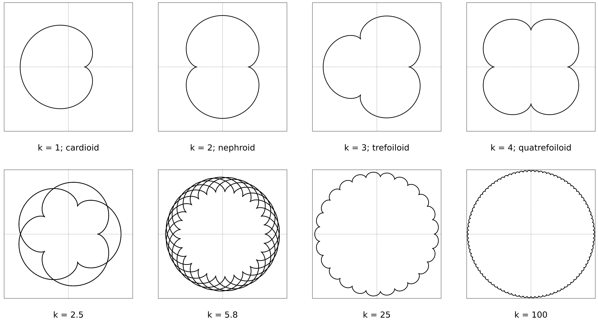

# Roulette curves, the coin paradox, and Aristotle’s wheel

Computational companion to the article **“Roullete curves, coin paradox and Aristotle’s wheel paradox”**, published in *Revista Brasileira de Ensino de Física*, volume 47, e20250401 (2025). The repository implements the parametric geometry of epicycloids and hypocycloids and uses these curves to explain two apparent paradoxes of rolling motion.

> The spelling “Roullete” is retained only when reproducing the published title. The standard mathematical term is **roulette**.



## Publication

**Santos-Pereira, O. L.** (2025). Roullete curves, coin paradox and Aristotle’s wheel paradox. *Revista Brasileira de Ensino de Física, 47*, e20250401. [https://doi.org/10.1590/1806-9126-RBEF-2025-0401](https://doi.org/10.1590/1806-9126-RBEF-2025-0401)

- [HTML at SciELO](https://www.scielo.br/j/rbef/a/4JqG3XG435VBQT3FV8ryFhS/?lang=en)
- [Published PDF](https://www.scielo.br/j/rbef/a/4JqG3XG435VBQT3FV8ryFhS/?format=pdf&lang=en)
- [arXiv:2512.00123](https://arxiv.org/abs/2512.00123)
- [Portuguese manuscript](roullete_curves_coin_paradox_portuguese.pdf)
- [Complete bibliography](REFERENCES.md)

## Mathematical scope

A roulette is the trajectory of a point attached to a curve that rolls, without slipping, along another curve. For a circle of radius \(r\) rolling outside a fixed circle of radius \(R\), the traced epicycloid is

\[
x(\theta)=(R+r)\cos\theta-r\cos\!\left(\frac{R+r}{r}\theta\right),
\qquad
y(\theta)=(R+r)\sin\theta-r\sin\!\left(\frac{R+r}{r}\theta\right).
\]

The external rotation count is \((R+r)/r\). For two equal coins, \(R=r\), this gives two rotations: one from rolling through the fixed circumference and one from transporting the moving frame around the fixed coin.

For internal rolling, the corresponding hypocycloid is

\[
x(\theta)=(R-r)\cos\theta+r\cos\!\left(\frac{R-r}{r}\theta\right),
\qquad
y(\theta)=(R-r)\sin\theta-r\sin\!\left(\frac{R-r}{r}\theta\right).
\]

Aristotle’s wheel involves a different constraint. Two concentric circles are rigidly connected, but only the outer circle rolls without slipping on the supporting line. The inner circle therefore translates and rotates with the assembly while sliding relative to a line tangent to it; its motion cannot be treated as an independent no-slip rolling condition.

## Repository contents

```text
coinparadox/
├── coinparadox.py      # reusable equations and validation
├── code_coin_paradox_aristotle_wheel_paradox.ipynb
├── figures/            # publication figures
├── auxiliary_files/    # prototypes and figure-generation notebooks
├── *.mp4               # rendered epicycloid and hypocycloid animations
├── REFERENCES.md
├── CITATION.cff
└── requirements.yml
```

The main notebook is the reader-facing computational companion. The notebooks in `auxiliary_files/` document the development of individual figures and are retained for provenance. Generated outputs are not embedded in the notebooks because the final PNG and MP4 artifacts are already versioned.

## Installation

Create the reproducible Conda environment:

```bash
git clone https://github.com/ozsp12/coinparadox.git
cd coinparadox
conda env create -f requirements.yml
conda activate coinparadox
jupyter lab
```

The core equations can also be used directly:

```python
import numpy as np
from coinparadox import epicycloid, hypocycloid, rotation_count

theta = np.linspace(0.0, 2.0 * np.pi, 2_000)
x_external, y_external = epicycloid(theta, R=3.0, r=1.0)
x_internal, y_internal = hypocycloid(theta, R=3.0, r=1.0)
assert rotation_count(R=1.0, r=1.0, internal=False) == 2.0
```

To regenerate the animations from the notebook, `ffmpeg` must be available in the active environment. Static calculations and figures require only NumPy and Matplotlib.

## Reproducibility

- Radii are validated explicitly: \(R>0\), \(r>0\), and \(R>r\) for internal rolling.
- Mathematical regression tests cover closure, initial points, the equal-coin rotation count, and the \(R=2r\) hypocycloid degeneracy.
- Notebook outputs are cleared before versioning; figures and videos are stored as separate artifacts.

Run the tests with:

```bash
python -m unittest discover -s tests -v
```

## Citation

The preferred citation is the published article above. Repository metadata are also available in [`CITATION.cff`](CITATION.cff), which enables GitHub’s **Cite this repository** function.

## Author

**Dr. Osvaldo L. Santos-Pereira** — [Academic webpage](https://ozsp12.github.io/) · [Lattes](http://lattes.cnpq.br/6730251976463283) · [ORCID](https://orcid.org/0000-0003-2231-517X) · [Google Scholar](https://scholar.google.com/citations?user=HIZp0X8AAAAJ&hl=en) · [ResearchGate](https://www.researchgate.net/profile/Osvaldo-Santos-Pereira) · [GitHub](https://github.com/ozsp12) · [LinkedIn](https://www.linkedin.com/in/ozsp12) · [Substack](https://substack.com/@olsp1982) · [Medium](https://medium.com/@ozsp12) · [YouTube](https://www.youtube.com/@ozlsp12) · [X](https://x.com/ozsp12)
